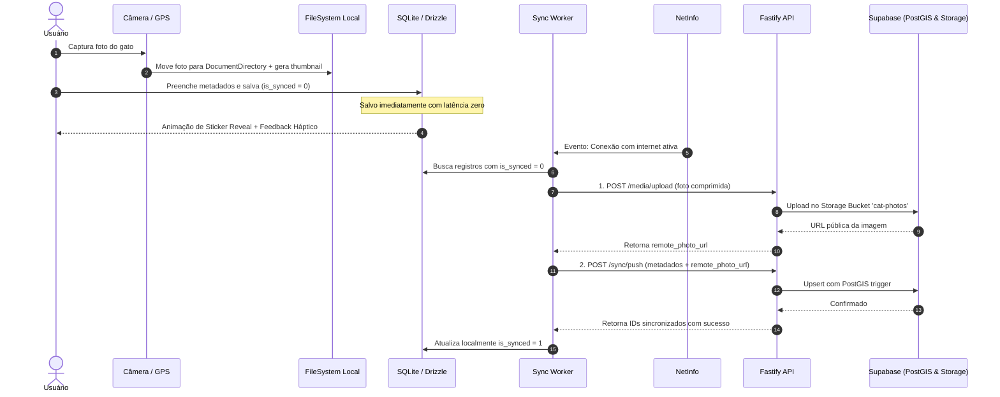

# Plano de Implementação Técnica (spec-plan.md): Catmon Mobile & Backend API

**Versão**: 1.0.0 | **Data**: 2026-09-18 | **Status**: Pronto para Execução  
**Especificação**: [specs/001-catmon-mvp/spec.md](file:///Users/viniciussantiago/Projects/catmon/specs/001-catmon-mvp/spec.md) | **Plano SpecKit**: [specs/001-catmon-mvp/plan.md](file:///Users/viniciussantiago/Projects/catmon/specs/001-catmon-mvp/plan.md)

---

## 1. Visão Geral e Filosofia Arquitetural

O **Catmon** é um diário de campo urbano gamificado para registrar e colecionar avistamentos de gatos no mundo real em formato de stickers/cards digitais ("Catdex"), com mapeamento geográfico e metadados de comportamento.

### Diretrizes Inegociáveis (Constitution Gates):
1. **Offline-First & Instant Capture:** Toda a captura, compressão de imagem e persistência em banco de dados ocorre estritamente no dispositivo com latência zero. A rede nunca é uma dependência bloqueante na UX.
2. **Privacy by Default (Geofencing Ético):** Localizações com contexto `friend_pet` (residência privada) sofrem ofuscação espacial automática com ruído pseudo-aleatório de 150m a 300m antes de qualquer plotagem ou envio para a nuvem.
3. **Gamificação Tátil:** Uso intensivo de `react-native-reanimated` (v4) e `expo-haptics` para criar a sensação tátil de "descolar e colar adesivos em um álbum físico".
4. **Tipagem Estrita de Ponta a Ponta:** TypeScript em `strict: true` unificado desde o schema do Drizzle ORM no SQLite local até os contratos de API com o backend Supabase.

---

## 2. Arquitetura de Dados & Schemas

### 2.1 Mobile: Drizzle ORM com `expo-sqlite`
Arquivo: `src/database/schema.ts`

```typescript
import { sqliteTable, text, real, integer } from 'drizzle-orm/sqlite-core';
import { sql } from 'drizzle-orm';

export const catsTable = sqliteTable('cats', {
  id: text('id').primaryKey(), // UUID v4 gerado no cliente
  name: text('name').notNull().default('Gato Misterioso'),
  breed: text('breed').notNull().default('SRD (Sem Raça Definida)'),
  context: text('context', { enum: ['stray', 'friend_pet', 'community', 'cat_cafe', 'other'] })
    .notNull()
    .default('stray'),
  color: text('color').notNull().default('#F39C12'),
  temperament: text('temperament', { enum: ['friendly', 'shy', 'playful', 'sleeper'] })
    .notNull()
    .default('friendly'),
  approxAge: text('approx_age', { enum: ['kitten', 'young', 'adult', 'senior'] })
    .notNull()
    .default('adult'),
  
  // Coordenadas Geoespaciais
  latitude: real('latitude').notNull(),
  longitude: real('longitude').notNull(),
  isObfuscated: integer('is_obfuscated', { mode: 'boolean' }).notNull().default(false),
  
  // Mídia no Filesystem Local e Remoto
  localPhotoUri: text('local_photo_uri').notNull(),
  localThumbnailUri: text('local_thumbnail_uri'),
  remotePhotoUrl: text('remote_photo_url'),
  
  // Metadados
  notes: text('notes'),
  
  // Controle de Sincronização
  isSynced: integer('is_synced', { mode: 'boolean' }).notNull().default(false),
  createdAt: text('created_at').notNull().default(sql`CURRENT_TIMESTAMP`),
  updatedAt: text('updated_at').notNull().default(sql`CURRENT_TIMESTAMP`),
});

export type Cat = typeof catsTable.$inferSelect;
export type NewCat = typeof catsTable.$inferInsert;
```

### 2.2 Backend Remoto: Supabase + PostgreSQL + PostGIS
Arquivo: `supabase/migrations/20260918000001_create_cats_and_postgis.sql`

```sql
-- Habilitar extensões
CREATE EXTENSION IF NOT EXISTS postgis;
CREATE EXTENSION IF NOT EXISTS "uuid-ossp";

-- Enums
CREATE TYPE cat_context_enum AS ENUM ('stray', 'friend_pet', 'community', 'cat_cafe', 'other');
CREATE TYPE cat_temperament_enum AS ENUM ('friendly', 'shy', 'playful', 'sleeper');
CREATE TYPE cat_approx_age_enum AS ENUM ('kitten', 'young', 'adult', 'senior');

-- Tabela Remota
CREATE TABLE IF NOT EXISTS public.cats (
    id UUID PRIMARY KEY DEFAULT uuid_generate_v4(),
    user_id UUID REFERENCES auth.users(id) ON DELETE SET NULL,
    name VARCHAR(100) NOT NULL DEFAULT 'Gato Misterioso',
    breed VARCHAR(100) NOT NULL DEFAULT 'SRD (Sem Raça Definida)',
    context cat_context_enum NOT NULL DEFAULT 'stray',
    color VARCHAR(30) NOT NULL DEFAULT '#F39C12',
    temperament cat_temperament_enum NOT NULL DEFAULT 'friendly',
    approx_age cat_approx_age_enum NOT NULL DEFAULT 'adult',
    latitude DOUBLE PRECISION NOT NULL,
    longitude DOUBLE PRECISION NOT NULL,
    is_obfuscated BOOLEAN NOT NULL DEFAULT false,
    location_geom GEOGRAPHY(Point, 4326),
    local_photo_uri TEXT,
    remote_photo_url TEXT,
    notes TEXT,
    is_synced BOOLEAN NOT NULL DEFAULT true,
    created_at TIMESTAMPTZ NOT NULL DEFAULT timezone('utc'::text, now()),
    updated_at TIMESTAMPTZ NOT NULL DEFAULT timezone('utc'::text, now())
);

-- Trigger de Cálculo Automático do Ponto PostGIS
CREATE OR REPLACE FUNCTION public.sync_cat_location_geom()
RETURNS TRIGGER AS $$
BEGIN
    NEW.location_geom := ST_SetSRID(ST_MakePoint(NEW.longitude, NEW.latitude), 4326)::geography;
    NEW.updated_at := timezone('utc'::text, now());
    RETURN NEW;
END;
$$ LANGUAGE plpgsql;

CREATE TRIGGER trigger_update_cat_location_geom
BEFORE INSERT OR UPDATE ON public.cats
FOR EACH ROW EXECUTE FUNCTION public.sync_cat_location_geom();

-- Índices Espaciais
CREATE INDEX IF NOT EXISTS idx_cats_geom ON public.cats USING GIST (location_geom);
CREATE INDEX IF NOT EXISTS idx_cats_updated_at ON public.cats (updated_at);

-- Função de Busca por Proximidade (Raio em metros)
CREATE OR REPLACE FUNCTION public.get_cats_within_radius(
    center_lat DOUBLE PRECISION,
    center_lng DOUBLE PRECISION,
    radius_meters DOUBLE PRECISION
)
RETURNS SETOF public.cats AS $$
BEGIN
    RETURN QUERY
    SELECT *
    FROM public.cats
    WHERE ST_DWithin(
        location_geom,
        ST_SetSRID(ST_MakePoint(center_lng, center_lat), 4326)::geography,
        radius_meters
    )
    ORDER BY ST_Distance(
        location_geom,
        ST_SetSRID(ST_MakePoint(center_lng, center_lat), 4326)::geography
    ) ASC;
END;
$$ LANGUAGE plpgsql STABLE;
```

---

## 3. Estratégia Offline-First & Sincronização Incremental



### Tratamento de Falhas & Conflitos
- **Identificadores Criados no Cliente (UUIDv4):** Evita duplicidade em caso de reenvio de lotes.
- **Resolução de Conflitos (LWW - Last Write Wins):** Baseada no timestamp `updated_at`.
- **Retry com Backoff Exponencial:** Falhas em uploads de mídia reagendam o worker para 5s, 15s, 45s, sem bloquear a interface do usuário.

---

## 4. Arquitetura de Animações com Reanimated 4

### 4.1 Microinteração de Captura (Sticker Print / Reveal)
- **Componente:** `src/components/animated/sticker-reveal.tsx`
- **Mecânica:**
  - `scale`: De `0.3` para `1.08` e estabiliza em `1.0` via `withSpring({ damping: 12, stiffness: 120 })`.
  - `rotation`: Jitter aleatório entre `-4deg` e `+4deg` para dar sensação de adesivo colado manualmente.
  - `border`: Borda branca de sticker com relevo sombreado (`shadowOpacity: 0.25`, `elevation: 6`).
  - `haptics`: `Haptics.notificationAsync(Haptics.NotificationFeedbackType.Success)` disparado no pico da animação.

### 4.2 Interação na Catdex: Flip Card 3D
- **Componente:** `src/components/animated/flip-card.tsx`
- **Mecânica:**
  - Perspectiva simulada em 3D: `transform: [{ perspective: 1000 }, { rotateY: `${rotation.value}deg` }]`.
  - Duas faces renderizadas em paralelo com `backfaceVisibility: 'hidden'`:
    - **Frente:** Sticker colorido recortado, foto, nome e badges de temperamento.
    - **Verso:** Ficha técnica com coordenadas, data/hora do encontro, pelagem presumida, notas e miniatura de mapa.

---

## 5. Divisão de Fases de Execução

### Fase 1: Setup Core Mobile, Drizzle ORM & Captura Básica
- [ ] Instalação e configuração de `expo-sqlite`, `drizzle-orm` e `drizzle-kit`.
- [ ] Implementação de `src/database/schema.ts` e inicialização em `src/database/client.ts`.
- [ ] Configuração de permissões e integração com `expo-camera` e `expo-location`.
- [ ] Serviço de mídia `src/services/media.ts` para persistência segura em `FileSystem.documentDirectory`.
- [ ] Modal de cadastro de metadados (`name`, `context`, `temperament`, `approx_age`).
- [ ] Teste unitário do fluxo de gravação offline no SQLite.

### Fase 2: Catdex Colecionável & Cat Map com Reanimated 4
- [ ] Implementação de `StickerReveal` e `FlipCard` com Reanimated 4 e `expo-haptics`.
- [ ] Galeria Catdex em grid responsivo com miniaturas em cache (`expo-image`).
- [ ] Barra de filtros dinâmicos por temperamento e contexto com Zustand.
- [ ] Tela de detalhe expandida em `src/app/cat/[id].tsx`.
- [ ] Cat Map via `react-native-maps` com marcadores personalizados.
- [ ] Algoritmo de ofuscação geoespacial ética (150m-300m) para `friend_pet`.

### Fase 3: Setup Node.js, Supabase & Pipeline de Sincronização
- [ ] Inicialização do projeto Fastify com TypeScript em `backend/`.
- [ ] Migração Supabase com extensão `postgis`, tabela `cats`, índices GIST e RPC `get_cats_within_radius`.
- [ ] Bucket `cat-photos` no Supabase Storage.
- [ ] Rotas `/api/v1/media/upload`, `/api/v1/sync/push`, `/api/v1/sync/pull` e `/api/v1/cats/nearby`.
- [ ] Mobile `SyncWorker` escutando `@react-native-community/netinfo` para upload assíncrono.

### Fase 4: Polimento Visual, Permissões e Testes
- [ ] Telas explicativas pré-permissão (Progressive Permission Onboarding).
- [ ] Fallback elegante para recusa de GPS (seleção manual no mapa) e recusa de câmera (galeria).
- [ ] Testes unitários com Jest e React Native Testing Library.
- [ ] Validação rigorosa com `npx tsc --noEmit` e `npx expo lint`.
