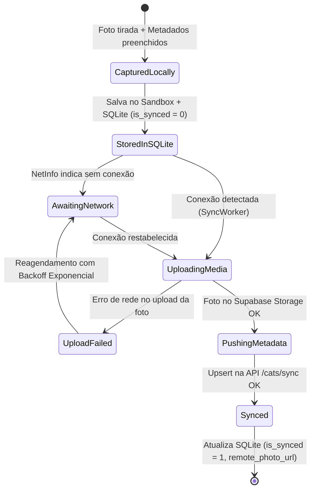

# Data Model & Schemas: 001-catmon-mvp

## 1. Domain Types & Enums (Shared Contract)

```typescript
export type UUID = string;
export type ISO8601Timestamp = string;

export enum CatContext {
  STRAY = 'stray',           // Gato de rua
  FRIEND_PET = 'friend_pet', // Pet de amigo / residência privada
  COMMUNITY = 'community',   // Gato comunitário (praça, comércio)
  CAT_CAFE = 'cat_cafe',     // Gato de cafeteria
  OTHER = 'other'            // Outro contexto
}

export enum CoatPattern {
  TABBY = 'tabby',                 // Rajado
  SOLID_BLACK = 'solid_black',     // Preto
  SOLID_WHITE = 'solid_white',     // Branco
  ORANGE_CARAMEL = 'orange_caramel',// Laranja / Caramelo
  TUXEDO = 'tuxedo',               // Frajola
  CALICO_TORTIE = 'calico_tortie', // Tricolor / Escaminha
  SIAMESE_POINT = 'siamese_point', // Siamês
  BICOLOR = 'bicolor',             // Bicolor
  OTHER = 'other'
}

export enum CatTemperament {
  FRIENDLY = 'friendly', // Dócil
  SHY = 'shy',           // Arredio / tímido
  PLAYFUL = 'playful',   // Brincalhão
  SLEEPER = 'sleeper'    // Dorminhoco
}

export enum ApproxAge {
  KITTEN = 'kitten', // Filhote (< 6m)
  YOUNG = 'young',   // Jovem (6m - 2a)
  ADULT = 'adult',   // Adulto (2a - 8a)
  SENIOR = 'senior'  // Idoso (8a+)
}

export enum LocationPrivacyMode {
  EXACT = 'exact',
  BLURRED = 'blurred',
  MANUAL = 'manual'
}
```

---

## 2. Mobile Local Schema: Drizzle ORM (`expo-sqlite`)

Arquivo: `src/database/schema.ts`

```typescript
import { sqliteTable, text, real, integer } from 'drizzle-orm/sqlite-core';
import { sql } from 'drizzle-orm';

export const catsTable = sqliteTable('cats', {
  id: text('id').primaryKey(), // UUID v4 gerado no cliente
  name: text('name').notNull().default('Gato Misterioso'),
  breed: text('breed').notNull().default('SRD (Sem Raça Definida)'),
  context: text('context', { enum: ['stray', 'friend_pet', 'community', 'cat_cafe', 'other'] })
    .notNull()
    .default('stray'),
  color: text('color').notNull().default('#F39C12'), // Cor predominante ou hex para tema do card
  temperament: text('temperament', { enum: ['friendly', 'shy', 'playful', 'sleeper'] })
    .notNull()
    .default('friendly'),
  approxAge: text('approx_age', { enum: ['kitten', 'young', 'adult', 'senior'] })
    .notNull()
    .default('adult'),
  
  // Coordenadas Geoespaciais
  latitude: real('latitude').notNull(),
  longitude: real('longitude').notNull(),
  isObfuscated: integer('is_obfuscated', { mode: 'boolean' }).notNull().default(false),
  
  // Armazenamento de Fotos
  localPhotoUri: text('local_photo_uri').notNull(), // Caminho permanente no sandbox FileSystem.documentDirectory
  localThumbnailUri: text('local_thumbnail_uri'),   // Miniatura otimizada para grids e pins
  remotePhotoUrl: text('remote_photo_url'),         // URL após upload no Supabase Storage
  
  // Metadados Opcionais
  notes: text('notes'),
  
  // Sincronização & Auditoria
  isSynced: integer('is_synced', { mode: 'boolean' }).notNull().default(false),
  createdAt: text('created_at').notNull().default(sql`CURRENT_TIMESTAMP`),
  updatedAt: text('updated_at').notNull().default(sql`CURRENT_TIMESTAMP`),
});

export type Cat = typeof catsTable.$inferSelect;
export type NewCat = typeof catsTable.$inferInsert;
```

---

## 3. Backend Remote Schema: Supabase PostgreSQL + PostGIS

Arquivo de Migração SQL: `supabase/migrations/20260918000001_create_cats_and_postgis.sql`

```sql
-- Habilitar extensão geoespacial PostGIS
CREATE EXTENSION IF NOT EXISTS postgis;
CREATE EXTENSION IF NOT EXISTS "uuid-ossp";

-- Enum Types no PostgreSQL
CREATE TYPE cat_context_enum AS ENUM ('stray', 'friend_pet', 'community', 'cat_cafe', 'other');
CREATE TYPE cat_temperament_enum AS ENUM ('friendly', 'shy', 'playful', 'sleeper');
CREATE TYPE cat_approx_age_enum AS ENUM ('kitten', 'young', 'adult', 'senior');

-- Tabela Principal no Supabase
CREATE TABLE IF NOT EXISTS public.cats (
    id UUID PRIMARY KEY DEFAULT uuid_generate_v4(),
    user_id UUID REFERENCES auth.users(id) ON DELETE SET NULL,
    name VARCHAR(100) NOT NULL DEFAULT 'Gato Misterioso',
    breed VARCHAR(100) NOT NULL DEFAULT 'SRD (Sem Raça Definida)',
    context cat_context_enum NOT NULL DEFAULT 'stray',
    color VARCHAR(30) NOT NULL DEFAULT '#F39C12',
    temperament cat_temperament_enum NOT NULL DEFAULT 'friendly',
    approx_age cat_approx_age_enum NOT NULL DEFAULT 'adult',
    
    -- Coordenadas Numéricas
    latitude DOUBLE PRECISION NOT NULL,
    longitude DOUBLE PRECISION NOT NULL,
    is_obfuscated BOOLEAN NOT NULL DEFAULT false,
    
    -- Ponto Geográfico PostGIS (Calculado via Trigger/Generated Column para consultas de alta performance)
    location_geom GEOGRAPHY(Point, 4326),
    
    -- Mídia
    local_photo_uri TEXT,
    remote_photo_url TEXT,
    notes TEXT,
    
    -- Auditoria e Sincronização
    is_synced BOOLEAN NOT NULL DEFAULT true,
    created_at TIMESTAMPTZ NOT NULL DEFAULT timezone('utc'::text, now()),
    updated_at TIMESTAMPTZ NOT NULL DEFAULT timezone('utc'::text, now())
);

-- Trigger para manter location_geom sincronizado com (longitude, latitude)
CREATE OR REPLACE FUNCTION public.sync_cat_location_geom()
RETURNS TRIGGER AS $$
BEGIN
    NEW.location_geom := ST_SetSRID(ST_MakePoint(NEW.longitude, NEW.latitude), 4326)::geography;
    NEW.updated_at := timezone('utc'::text, now());
    RETURN NEW;
END;
$$ LANGUAGE plpgsql;

CREATE TRIGGER trigger_update_cat_location_geom
BEFORE INSERT OR UPDATE ON public.cats
FOR EACH ROW EXECUTE FUNCTION public.sync_cat_location_geom();

-- Índices de Otimização
CREATE INDEX IF NOT EXISTS idx_cats_geom ON public.cats USING GIST (location_geom);
CREATE INDEX IF NOT EXISTS idx_cats_updated_at ON public.cats (updated_at);
CREATE INDEX IF NOT EXISTS idx_cats_user_id ON public.cats (user_id);

-- Função de Busca de Proximidade Espacial
CREATE OR REPLACE FUNCTION public.get_cats_within_radius(
    center_lat DOUBLE PRECISION,
    center_lng DOUBLE PRECISION,
    radius_meters DOUBLE PRECISION
)
RETURNS SETOF public.cats AS $$
BEGIN
    RETURN QUERY
    SELECT *
    FROM public.cats
    WHERE ST_DWithin(
        location_geom,
        ST_SetSRID(ST_MakePoint(center_lng, center_lat), 4326)::geography,
        radius_meters
    )
    ORDER BY ST_Distance(
        location_geom,
        ST_SetSRID(ST_MakePoint(center_lng, center_lat), 4326)::geography
    ) ASC;
END;
$$ LANGUAGE plpgsql STABLE;
```

---

## 4. State Transitions (Offline-to-Online Sync Lifecycle)


